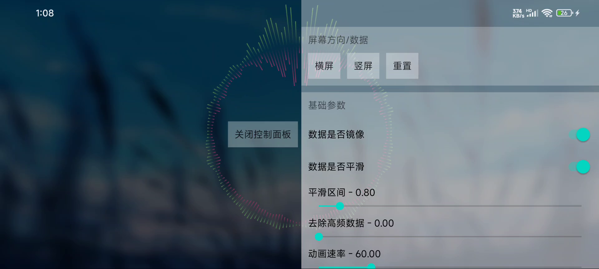
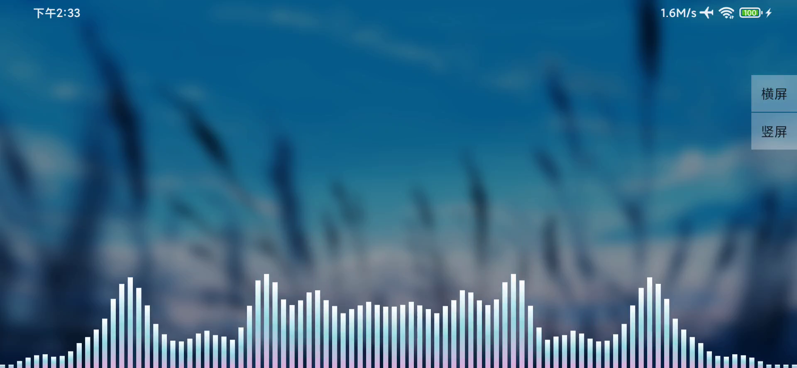

音频可视化
===
提供比较稳定的可视化组件


环形 AnnularAudioView.class
----



直方 StraightSideAudioView.class
----


演示 [assets/v1.0.mp4]
----
<video src="视频链接" controls="controls" width="500" height="300">您的浏览器不支持播放该视频！</video>


用法
---
>1. 权限
```xml
<uses-permission android:name="android.permission.RECORD_AUDIO" />
<uses-permission android:name="android.permission.MODIFY_AUDIO_SETTINGS" />
```
<br>


>2. 布局引用
```xml
    <com.pikachu.visualization.view.StraightSideAudioViewKt
        android:id="@+id/audio"
        android:layout_width="0dp"
        android:layout_height="0dp"
        app:layout_constraintBottom_toBottomOf="parent"
        app:layout_constraintEnd_toEndOf="parent"
        app:layout_constraintStart_toStartOf="parent"
        app:layout_constraintTop_toTopOf="parent" />
```
<br>

>3. 控制  当然还要播放一首Dj啦
```java

// 启动  必须有权限(动态申请)
mStraightSideAudioViewKt.start()

// 停止
mStraightSideAudioViewKt.stop()

```
<br>


自己动手丰衣足食
---
>1. 继承BaseAudioView 根据float[] transform频谱数据图画控件
```java
/**
 * @param widthMeasureSpec  宽度测量规范
 * @param heightMeasureSpec 高度测量规范
 * @return 返回FFT数据长度
 */
protected abstract int onAudioMeasure(int widthMeasureSpec, int heightMeasureSpec);


/**
 * 画数据时
 * 继承后直接在这里面画即可  处理后的FFT数据 transform
 *
 * @param canvas    画布
 * @param transform 处理后的FFT数据
 */
protected abstract void drawView(Canvas canvas, float[] transform);

```
<br>


>2. 一些属性设置
```java
    // 是否镜像
    void setMirror(boolean mirror)

    // 跳过开头的第几个值  靠前值浮动大
    void setCountIndex(int countIndex) 

    // 是否平滑
    void setSmooth(boolean smooth)

    // 平滑区间
    void setSmoothInterval(int smoothInterval)

    // 动画速度 ms
    void setAnimationSpeed(int animationSpeed)

    // 差值器
    void setTimeInterpolator(TimeInterpolator timeInterpolator)
    
    // 最大值
    void setMaxRange(float maxRange)

    // 幅度
    void setRange(float range)

    // 阻力 值越大加的越少
    void setResistance(float resistance)

```
